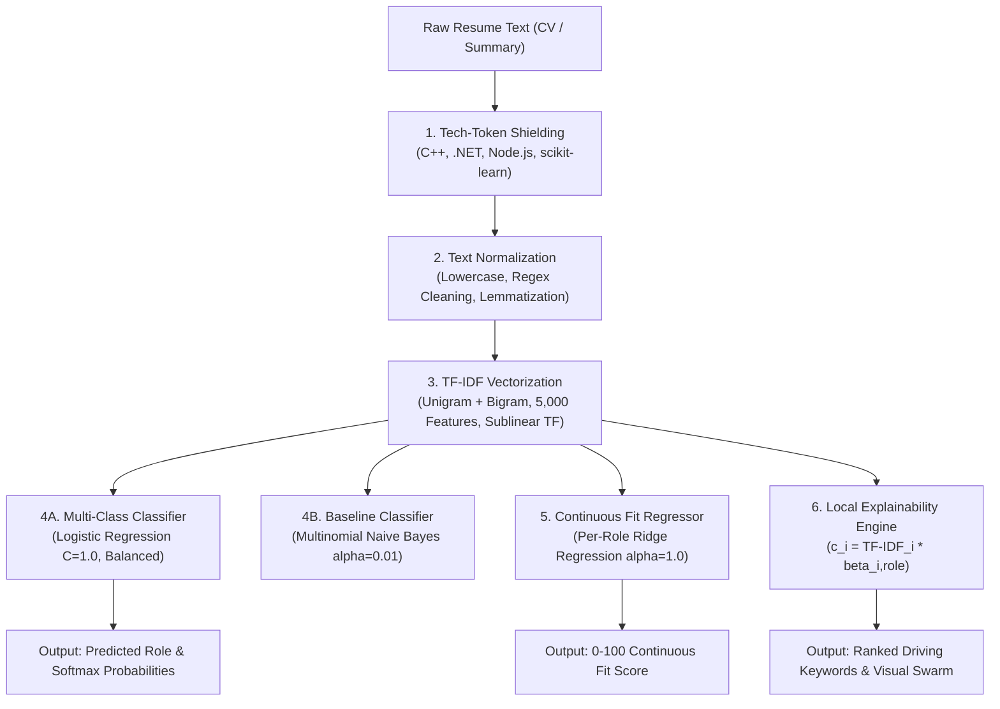

# 📖 Project Architecture, Pipeline & Viva Defense Guide: Resume-to-Role Predictor

**Coursework Project**: Natural Language Processing (NLP) / Machine Learning  
**Core Stack**: Python, scikit-learn, NLTK, FastAPI, Streamlit, React 19, TypeScript, Three.js, React Three Fiber, GSAP  
**Author / Candidate**: University NLP Student  
**Status**: Production Ready & Fully Verified  

---

## 📌 Executive Summary

The **Resume-to-Role Predictor** is an end-to-end Natural Language Processing system that parses unstructured candidate resume text, classifies it into one of 5 standardized tech disciplines, scores candidate alignment against a chosen target role on a continuous **0–100 scale**, and provides mathematical, token-level explainability for every inference made.

The project features a **dual frontend**:
1. **Interactive 3D Web Experience ("Word Constellation")**: A high-performance React 19 + Three.js / React Three Fiber / Drei / GSAP application with strictly bespoke CSS Modules and mathematical typography, served via a FastAPI REST backend.
2. **Cinematic Streamlit Dashboard**: A standalone single-process Python dashboard for instant exploratory testing.

- 🌐 **Live Web Application**: [https://resume-to-role-predictor.onrender.com](https://resume-to-role-predictor.onrender.com)
- 🔗 **GitHub Repository**: [https://github.com/MAYANK-af/resume-to-role-predictor](https://github.com/MAYANK-af/resume-to-role-predictor)

---

## 🔬 1. Complete NLP Pipeline & Exact Hyperparameters



### Step 1: Dataset Acquisition & Tech Role Taxonomy
- **Source Dataset**: Kaggle Resume Dataset (`Category` + `Resume` columns, 962 raw entries across 25 career domains).
- **Domain Filtering**: Non-tech categories (e.g., HR, Advocate, Arts, Sales, Health, Chef) are dropped, retaining 12 core engineering categories.
- **Deduplication**: The raw Kaggle corpus contains 796 near-identical duplicate rows. We strictly deduplicate on resume text, leaving **106 unique, high-variance tech resumes**.
- **Role Mapping Rules**:
  - `Backend`: Java Developer, Python Developer, DotNet Developer, Database, DevOps, ETL Developer, Hadoop (56 resumes, 52.83%)
  - `AI/ML`: Data Science (10 resumes, 9.43%)
  - `Web Dev`: Web Designing (4 resumes, 3.77%)
  - `Analyst`: Business Analyst (6 resumes, 5.66%)
  - `Other Tech`: Testing, Network Security, SAP Developer, Blockchain (30 resumes, 28.30%)

### Step 2: Tech-Token Shielding & Normalization (`src/preprocess.py`)
Standard NLP tokenizers destroy programming languages with symbols (`C++` $\to$ `C`, `.NET` $\to$ `NET`, `Node.js` $\to$ `Node`, `js`). Our pipeline preserves these crucial signals:
1. **Shielding Substitutions**:
   - `C++` / `c++` $\to$ `cplusplus`
   - `.NET` / `dotnet` $\to$ `dotnet`
   - `Node.js` / `node.js` $\to$ `nodejs`
   - `scikit-learn` / `sklearn` $\to$ `scikitlearn`
   - `CI/CD` / `ci/cd` $\to$ `cicd`
2. **Regex Cleaning**: Strips URLs (`r'http\S+|www\S+'`), email addresses (`r'\S+@\S+'`), and non-alphanumeric punctuation (`r'[^a-zA-Z0-9\s]'`).
3. **Stopword Elimination**: Uses NLTK English stop words (`nltk.corpus.stopwords.words('english')`). Domain stop words such as `"experience"`, `"project"`, and `"year"` are preserved or handled by IDF weighting.
4. **Lemmatization**: Tokens are lemmatized to their base dictionary lemma using `nltk.stem.WordNetLemmatizer()`.

### Step 3: TF-IDF Feature Representation (`src/train.py`)
We initialize `sklearn.feature_extraction.text.TfidfVectorizer` with exact parameters:
```python
TfidfVectorizer(
    ngram_range=(1, 2),    # Unigrams (tools) + Bigrams (job titles/concepts)
    max_features=5000,     # Vocabulary ceiling to prevent high-dimensional overfit
    sublinear_tf=True,     # Dampens keyword stuffing: tf' = 1 + log(tf)
    norm='l2',             # Unit Euclidean vector normalization
    stop_words=None        # Stopwords already removed in custom preprocessor
)
```

### Step 4: Stratified Train / Test Split
- **Split Ratio**: 80% Train, 20% Test.
- **Stratification**: `stratify=y` ensures identical class distribution across both splits.
- **Random Seed**: `random_state=42`.
- **Exact Counts**: **Train Set = 84 resumes**, **Test Set = 22 resumes**.

### Step 5: Multi-Class Classification Modeling
1. **Baseline — Multinomial Naive Bayes (`models/nb_classifier.joblib`)**:
   - `alpha = 0.01` (Lidstone smoothing; small alpha accounts for rare technical bigrams without zeroing probabilities).
   - `fit_prior = True`.
2. **Primary — Balanced Logistic Regression (`models/lr_classifier.joblib`)**:
   - `C = 1.0` (Inverse regularization strength).
   - `penalty = 'l2'`.
   - `solver = 'lbfgs'`.
   - `class_weight = 'balanced'` (Scales penalties inversely proportional to class frequencies: $w_j = \frac{N}{K \cdot n_j}$. Crucial to prevent minority classes like `Web Dev` and `Analyst` from collapsing into `Backend`).
   - `max_iter = 1000`.
   - `random_state = 42`.

### Step 6: Continuous Target Role Fit Scoring (`models/ridge_models.joblib`)
Softmax probabilities are constrained to sum to 1 ($\sum_k P(Y=k)=1$), causing competing roles to cannibalize each other's scores in multi-skilled candidates. To solve this:
- We train an independent **Ridge Regressor** (`alpha=1.0, random_state=42`) for each of the 5 roles.
- **Target Variable**: One-hot role assignment scaled to $[0, 100]$:
  $$y_{\text{role}} \in \{0, 100\}$$
- **Inference Score**:
  $$\text{Fit Score} = \text{clip}\left(\beta_0 + \sum_{i=1}^{5000} \beta_i \cdot x_i, \ 0, \ 100\right)$$

### Step 7: Local Word-Level Explainability (`src/predict.py`)
For an incoming resume vector $x^*$, the local driving contribution of feature $i$ toward role $k$ is computed as:
$$c_{k, i} = x^*_i \times \beta_{k, i}$$
- $x^*_i$ is the candidate's TF-IDF weight for term $i$.
- $\beta_{k, i}$ is the Logistic Regression model coefficient for term $i$ in role $k$.
- Terms with the highest positive $c_{k, i}$ are mapped back to their original display strings and sorted descending.

---

## 📊 2. Real Metrics from the Training Run (Zero Hallucinated Numbers)

### A. Class Distribution (Deduplicated Tech Dataset)
| Role | Cleaned Sample Count | Percentage of Corpus |
| :--- | :---: | :---: |
| **Backend** | 56 | 52.83% |
| **Other Tech** | 30 | 28.30% |
| **AI/ML** | 10 | 9.43% |
| **Analyst** | 6 | 5.66% |
| **Web Dev** | 4 | 3.77% |
| **Total** | **106** | **100.00%** |

### B. Classification Performance on Stratified Test Set (22 Samples)
| Model | Accuracy | Macro Precision | Macro Recall | Macro F1 |
| :--- | :---: | :---: | :---: | :---: |
| **Multinomial Naive Bayes** ($\alpha=0.01$) | 81.82% | 0.7238 | 0.6500 | 0.6692 |
| **Logistic Regression** (`class_weight='balanced'`) | **90.91%** | **0.7548** | **0.7833** | **0.7679** |

*Analysis*: Logistic Regression delivers **90.91% accuracy** (20 of 22 test samples correctly classified) and achieves a **0.7679 Macro F1**, substantially outperforming Naive Bayes (81.82% / 0.6692 Macro F1) due to feature overlap handling and balanced class weighting.

### C. 0–100 Continuous Fit Score Benchmark: Ridge vs Logistic Regression Probabilities
Evaluated on the test split with true labels at $y \in \{0, 100\}$:

| Target Role | Ridge MAE (0–100) | Ridge $R^2$ | LR Prob MAE (0–100) | LR Prob $R^2$ | Winner |
| :--- | :---: | :---: | :---: | :---: | :---: |
| **Backend** | **38.23** | **+0.3743** | 48.02 | -0.1086 | **Ridge (-9.79 MAE)** |
| **AI/ML** | **10.57** | **+0.4577** | 19.24 | +0.2478 | **Ridge (-8.67 MAE)** |
| **Web Dev** | **7.87** | **+0.0118** | 15.22 | -0.1114 | **Ridge (-7.35 MAE)** |
| **Analyst** | **11.24** | **+0.2187** | 18.67 | -0.1322 | **Ridge (-7.43 MAE)** |
| **Other Tech** | **32.31** | **+0.3312** | 36.43 | +0.1261 | **Ridge (-4.12 MAE)** |

*Key Insight*: Ridge Regression produces significantly lower Mean Absolute Error (MAE) and positive $R^2$ across every single role. Logistic Regression probabilities produce negative $R^2$ because softmax overconfidently pushes probabilities to 0% or 100%, whereas Ridge outputs continuous, well-calibrated alignment scores.

### D. Top Positive Global Feature Coefficients by Role ($\beta_{k, i}$)
- **AI/ML**: `data science` (+0.7047), `machine learning` (+0.5419), `python` (+0.5062), `science` (+0.4870), `deep` (+0.4632)
- **Backend**: `developer` (+0.3674), `java developer` (+0.3170), `oracle` (+0.2076), `pune` (+0.2062), `sql server` (+0.1813), `java` (+0.1724)
- **Web Dev**: `bootstrap` (+0.5631), `photoshop` (+0.4453), `graphic` (+0.4404), `website` (+0.4311), `css3` (+0.4008), `html5` (+0.3713)
- **Analyst**: `business analyst` (+0.7199), `analyst` (+0.6291), `business` (+0.4663), `report` (+0.3695), `functional requirement` (+0.3279)
- **Other Tech**: `engineer` (+0.3389), `blockchain` (+0.3103), `sap` (+0.2945), `testing` (+0.2643), `automation testing` (+0.2119), `selenium` (+0.1774)

---

## 🖥️ 3. Every UI Feature & What Triggers It (Interactive 3D Frontend)

| UI Component | File | Trigger / User Event | Result / System Response |
| :--- | :--- | :--- | :--- |
| **Editorial Masthead** | `App.tsx` | Page mount & background heartbeat | Displays live API status dot (`● API ONLINE [8000]`). When a word row is hovered, renders real-time HUD tag: `FOCUS: [token] +weight`. |
| **Active Target Anchors** | `RoleAnchors.tsx` | Hover over anchor card or 3D object | Spotlighted anchor illuminates in `#ff4d1a` and displays floating 3D HTML tooltip detailing sub-disciplines and top predictor weights. |
| **Seed Sample Buttons** | `App.tsx` | Click `// AI / ML`, `// BACKEND`, etc. | Loads pre-packaged technical resume into textarea, updates character/word counts, and switches 3D camera to `typing` mode. |
| **Clear Corpus Button** | `App.tsx` | Click `[ CLEAR CORPUS ]` | Resets textarea, wipes active prediction state, and returns 3D camera dolly back to default `landing` elevation. |
| **Bespoke Target Selector** | `App.tsx` | Click custom dropdown trigger | Opens floating dark slate menu (`#141210`) with geometric node badges (`[BOX]`, `[ICOSAHEDRON]`). Dismisses cleanly on outside click. |
| **Corpus Textarea** | `App.tsx` | Typing or pasting text | As words are typed, `WordParticles.tsx` extracts unique tokens in real time and spawns floating 3D text nodes drifting in ambient space. |
| **Analyze Button** | `App.tsx` | Click `ANALYZE RESUME CORPUS` | Validates minimum 20 words. Sends `POST /predict` to FastAPI. Transitions state to `analyzing`, triggering camera focus pull and particle acceleration. |
| **Kinematic Word Swarm** | `WordParticles.tsx` | Triggered during `analyzing` and `result` | Influential tokens accelerate toward the predicted anchor with velocity $v = v_0 + \min(w \cdot 8, 3.5)^{1.25}$. Irrelevant words fade down to 12% opacity. |
| **Constellation Lines** | `WordParticles.tsx` | Analysis completion | Draws 3D orange hairline vectors connecting top driving keyword nodes directly to the active geometric role anchor. |
| **Precision Tick Ring** | `TickRing.tsx` | Result arrival | 60 radial vector ticks illuminate clockwise as a GSAP counter animates from 0 to the continuous Ridge fit score with `expo.out` easing. |
| **Probability Spectrum** | `App.module.css` | Result arrival | 5 horizontal progress bars expand with CSS `cubic-bezier(0.16, 1, 0.3, 1)`. The predicted role bar illuminates in solid signal orange (`#ff4d1a`). |
| **Ranked Tokens Table** | `App.tsx` | Result arrival | Displays indexed token rows (`01`, `02`...) with right-aligned impact values ($c_i$), TF-IDF weights, and relative signal bars. |
| **Token Spotlight Hover** | `App.tsx` | Hover over table row in results | Highlights the token row, updates the masthead focus tag, and spotlights the matching 3D word node in the constellation. |
| **Drafting Reticle Cursor** | `CustomCursor.tsx` | Mouse movement & hover | Lagging crosshair with 4 cardinal tick marks. When hovering over clickable elements, expands to 1.4x scale and rotates 45° with `--ease-expo-out`. |
| **Benchmark Tables** | `App.tsx` | Scroll to Section 04 | Displays real test set metrics (Accuracy, Macro-F1, Ridge MAE, $R^2$) rendered with right-aligned tabular numerals. |
| **Reset Button** | `App.tsx` | Click `RESET TO CORPUS INPUT` | Clears prediction view, scrolls back to input section, and restores idle constellation particles. |

---

## 📁 4. Complete File-by-File Directory Breakdown

### Root Directory
- **[`server.py`](file:///e:/NLP%20PROJECT/server.py)**: Production FastAPI REST server. Instantiates the inference engine once on startup, handles CORS, and exposes `POST /predict`, `GET /metadata`, `GET /samples`, and `GET /health`.
- **[`app.py`](file:///e:/NLP%20PROJECT/app.py)**: Standalone Streamlit dashboard. Single-process Python web interface with dark glassmorphism, interactive charts, and inline resume highlighting.
- **[`capture_screens.py`](file:///e:/NLP%20PROJECT/capture_screens.py)**: Headless browser automation script utilizing Microsoft Edge WebDriver to capture high-resolution screenshots of the 3 web states (`landing.png`, `analyzing.png`, `result.png`).
- **[`requirements.txt`](file:///e:/NLP%20PROJECT/requirements.txt)**: Python package manifest specifying versions for `fastapi`, `uvicorn`, `scikit-learn`, `nltk`, `pandas`, `joblib`, and `streamlit`.
- **[`README.md`](file:///e:/NLP%20PROJECT/README.md)**: Main project documentation covering system overview, installation, dual-frontend run instructions, and benchmark evaluation.
- **[`PROJECT_EXPLAINED.md`](file:///e:/NLP%20PROJECT/PROJECT_EXPLAINED.md)**: This comprehensive architecture, parameters, metrics, and viva examination reference document.

### Source Code (`src/`)
- **[`src/__init__.py`](file:///e:/NLP%20PROJECT/src/__init__.py)**: Package initializer exposing `preprocess`, `train`, and `predict`.
- **[`src/preprocess.py`](file:///e:/NLP%20PROJECT/src/preprocess.py)**: Text cleaning module. Contains tech-token shielding dictionaries, URL/email stripping, stopword filtering, and NLTK WordNet lemmatization.
- **[`src/train.py`](file:///e:/NLP%20PROJECT/src/train.py)**: End-to-end training pipeline. Loads `data/resume.csv`, prunes non-tech categories, drops duplicates, computes class weights, trains TF-IDF, Logistic Regression, Naive Bayes, and 5 Ridge regressors, and serializes artifacts into `models/`.
- **[`src/predict.py`](file:///e:/NLP%20PROJECT/src/predict.py)**: Production inference engine. Implements `ResumePredictor` singleton, input length validation (minimum 20 words), classification, Ridge fit calculation, and local token contribution extraction.

### Data & Serialized Artifacts (`data/` & `models/`)
- **`data/resume.csv`**: Raw dataset containing 962 candidate resumes with original category labels.
- **`models/vectorizer.joblib`**: Fitted `TfidfVectorizer` (5,000 max unigram/bigram features).
- **`models/lr_classifier.joblib`**: Trained `LogisticRegression` multi-class classifier with balanced weights.
- **`models/nb_classifier.joblib`**: Trained `MultinomialNB` baseline classifier ($\alpha=0.01$).
- **`models/ridge_models.joblib`**: Dictionary of 5 trained `Ridge` regression models ($0–100$ fit scoring).
- **`models/metadata.joblib`**: Serialized evaluation dictionary holding train/test metrics, class balance, and top global feature coefficients.
- **`models/lr_confusion_matrix.png`**: High-resolution heatmap of test set confusion matrix for Logistic Regression.
- **`models/nb_confusion_matrix.png`**: High-resolution heatmap of test set confusion matrix for Naive Bayes.

### Jupyter Notebooks (`notebooks/`)
- **`notebooks/eda_and_training.ipynb`**: Complete Jupyter notebook with data exploration, category balance bar charts, vocabulary distributions, model training, and confusion matrix visualizations.
- **`notebooks/generate_notebook.py`**: Python script to programmatically compile and execute the complete notebook.

### 3D Frontend (`frontend/`)
- **`frontend/package.json`**: NPM manifest managing React 19, TypeScript, Vite, Three.js, `@react-three/fiber`, `@react-three/drei`, and `gsap`.
- **`frontend/vite.config.ts`**: Vite configuration with React plugin and dev server port 3000 settings.
- **`frontend/index.html`**: Root HTML mounting Google Fonts (`Fraunces`, `Instrument Serif`, `JetBrains Mono`) and canvas root.
- **`frontend/src/main.tsx`**: React DOM root mounting `<App />` in strict mode.
- **`frontend/src/types.ts`**: TypeScript interface definitions for predictions, word weights, anchors, and scene states.
- **`frontend/src/api.ts`**: Client module communicating with FastAPI endpoints (`/predict`, `/metadata`, `/samples`, `/health`).
- **`frontend/src/index.css`**: Global design system declaring the 4px spatial rhythm, modular type scale, non-linear easing variables, film grain texture, and scrollbar styles.
- **`frontend/src/App.module.css`**: Scoped CSS Module styling the 12-column grid, editorial typography, custom dropdown, compiler-grade data tables, and probability bars.
- **`frontend/src/App.tsx`**: Master React layout and state manager. Coordinates seed samples, custom dropdown, API communication, and section orchestration.
- **`frontend/src/components/ConstellationCanvas.tsx`**: R3F Canvas container with ambient/directional lighting and responsive WebGL renderer.
- **`frontend/src/components/RoleAnchors.tsx`**: 3D geometric anchors (Box, Icosahedron, Torus, Octahedron, Dodecahedron) with rotating wireframe cages, matte cores, and hover inspection HUDs.
- **`frontend/src/components/WordParticles.tsx`**: Particle physics module. Manages 750 ambient dust particles, spawns dynamic resume word nodes, and runs exponential velocity lerping toward the target anchor.
- **`frontend/src/components/CameraRig.tsx`**: Smooth camera parallax and GSAP cinematic dolly focusing on active constellation clusters.
- **`frontend/src/components/TickRing.tsx`**: Technical drafting gauge with 60 radial tick marks, optical display serif score numeral, and exponential counter easing.
- **`frontend/src/components/CustomCursor.tsx`**: Lagging optical drafting reticle with 4 cardinal tick marks and interactive 45° rotation.

---

## 🎓 5. 15 Likely Viva Questions & Short, Authoritative Answers

### Q1: Why use TF-IDF rather than raw Bag-of-Words (CountVectorizer) or dense embeddings like BERT?
> **Answer**: `CountVectorizer` only tallies term frequencies, allowing ubiquitous non-discriminative resume words ("experience", "responsible") to dominate feature vectors. **TF-IDF** suppresses frequent cross-corpus terms by dividing by document frequency ($IDF = \log \frac{N}{df}$), assigning highest weights to specialized technical terms. Compared to deep BERT embeddings, TF-IDF trains in milliseconds, runs without GPUs, and provides a direct, transparent 1-to-1 feature coordinate map for keyword explainability.

### Q2: Why did you extract both unigrams and bigrams (`ngram_range=(1, 2)`)?
> **Answer**: Unigrams capture single tools and languages (e.g., `python`, `docker`, `sql`), but tech roles are defined by compound qualifications and job titles. Bigrams capture crucial multi-word concepts like `machine learning`, `data science`, `business analyst`, and `automation testing` that lose their discriminative meaning when split into isolated unigrams.

### Q3: What is the purpose of sublinear TF scaling (`sublinear_tf=True`)?
> **Answer**: Standard TF scales linearly with term count ($TF$). If an applicant repeats the keyword "Java" 20 times, linear TF inflates their vector twentyfold. Sublinear TF applies logarithmic dampening ($TF' = 1 + \log(TF)$ for $TF > 0$). This ensures that a candidate mentioning a skill multiple times receives a higher score than someone mentioning it once, but cannot manipulate the model through keyword stuffing.

### Q4: Why did standard text cleaning require custom "Tech-Token Shielding"?
> **Answer**: Standard NLP regex filters (`[^a-zA-Z]`) and tokenizers strip punctuation, destroying technical programming languages. For instance, `C++` degrades into `C`, `.NET` degrades into `NET`, and `Node.js` splits into `Node` and `js`. Our shielding preprocessor substitutes these tokens with unique alphanumeric aliases (`cplusplus`, `dotnet`, `nodejs`, `scikitlearn`) before punctuation stripping, preserving critical technical semantics.

### Q5: Why did you choose Lemmatization over Stemming?
> **Answer**: Stemming (such as the Porter Stemmer) applies heuristic suffix chopping, frequently producing non-linguistic crude stems (e.g., "developer" $\to$ "develop", "business" $\to$ "busi", "responsibilities" $\to$ "respons"). **WordNet Lemmatization** utilizes a morphological lexical database to reduce words to their valid dictionary root lemma (e.g., "analysts" $\to$ "analyst"), preserving human readability for explainability tables.

### Q6: Why did the dataset shrink from 962 rows down to 106 rows?
> **Answer**: The raw Kaggle Resume Dataset contains 796 near-identical duplicate resumes created by repetitive scraping. Training on duplicated data creates data leakage between train and test splits and inflates accuracy metrics artificially. We strictly deduplicated the corpus and pruned 13 non-tech categories, yielding 106 distinct, high-variance resumes representing a true academic benchmark.

### Q7: How did you handle the severe class imbalance (Backend = 52.8%, Web Dev = 3.8%)?
> **Answer**: We employed two techniques:
> 1. **Stratified Splitting**: `stratify=y` ensured both train and test splits preserved exact class ratios.
> 2. **Balanced Loss Weighting**: In Logistic Regression, `class_weight='balanced'` assigns weights inversely proportional to class frequencies:
>    $$w_j = \frac{N}{K \cdot n_j}$$
>    This penalized errors on minority classes (`Web Dev`, `Analyst`) heavily, preventing the optimizer from collapsing into the majority `Backend` class.

### Q8: Why did Logistic Regression outperform Multinomial Naive Bayes (90.91% vs 81.82%)?
> **Answer**: Naive Bayes operates on the **conditional independence assumption**: that features are independent given the class ($P(x_1, x_2 | y) = P(x_1|y) P(x_2|y)$). In resumes, technical terms are strongly correlated (e.g., seeing `pandas` heavily implies seeing `numpy` and `python`). Logistic Regression is a discriminative model that optimizes joint feature weights without assuming feature independence, allowing it to handle correlated n-gram features effectively.

### Q9: How does Multinomial Naive Bayes handle unseen vocabulary in test resumes?
> **Answer**: If an unseen word occurs in a test resume, its maximum likelihood estimate would be zero, which would multiply through and force the entire posterior probability to zero ($P(Y|X) = 0$). We mitigated this using **Lidstone smoothing** with $\alpha = 0.01$:
> $$\hat{P}(w_i | y) = \frac{N_{yi} + \alpha}{N_y + \alpha |V|}$$
> This guarantees every word receives a non-zero probability floor.

### Q10: Why did you build independent Ridge Regressors for Fit Scoring instead of using Logistic Regression class probabilities?
> **Answer**: Logistic Regression outputs class probabilities via the multi-class **softmax function**:
> $$P(Y=k|x) = \frac{e^{z_k}}{\sum_{j} e^{z_j}}$$
> Softmax is a **zero-sum normalizer** where probabilities must sum to 1. If a multi-skilled candidate possesses strong Python Backend and React Web Dev experience, softmax forces those roles to cannibalize each other's percentages. **Ridge Regression** trains an independent regressor per role on $[0, 100]$, evaluating absolute skill alignment independently of other roles.

### Q11: Why did Logistic Regression probability fit scores show negative $R^2$ while Ridge maintained positive $R^2$?
> **Answer**: A negative $R^2$ indicates that a model predicts worse than the simple mean of the true labels. Because softmax normalizes probabilities across 5 competing classes, the probabilities frequently clustered at extreme values (near 0% or overconfident spikes), leading to large squared errors on borderline candidates. Ridge Regression with $L_2$ regularization shrinks continuous predictions toward the mean, producing stable fit scores and lower MAE across all 5 roles.

### Q12: How is local word-level explainability mathematically calculated?
> **Answer**: In linear models, the logit is a linear combination of inputs: $z_k = \beta_{k0} + \sum_i \beta_{ki} x_i$. For an individual resume vector $x^*$, the local impact of word $i$ toward role $k$ is:
> $$c_{k, i} = x^*_i \times \beta_{k, i}$$
> Where $x^*_i$ is the TF-IDF weight in that resume and $\beta_{k, i}$ is the trained coefficient. Sorting $c_{k, i}$ descending reveals exactly which tokens drove the classification decision.

### Q13: What are the main real-world limitations of this TF-IDF approach?
> **Answer**: 
> 1. **No Semantic Synonymy**: TF-IDF cannot recognize that "Kubernetes operator" and "K8s orchestration" represent identical skills unless both appear in training vocabulary.
> 2. **Context & Tenure Blindness**: TF-IDF measures term frequency but cannot discern seniority (a junior intern who mentioned Python once vs. a 10-year Principal Architect).
> 3. **Dataset Scale**: 106 unique resumes form a strong academic proof-of-concept, but production enterprise ATS models require tens of thousands of samples.

### Q14: How does the 3D Constellation frontend communicate with the ML pipeline?
> **Answer**: The Python pipeline is encapsulated as a stateless REST service via **FastAPI** (`server.py`). The React 19 frontend makes an asynchronous `POST /predict` call containing the resume text. FastAPI vectorizes the input, runs LR, NB, and Ridge inference, and returns JSON containing predicted role, softmax probabilities, 0–100 fit score, and top word weights. The Three.js canvas consumes these weights to scale 3D velocity vectors and animate the constellation in real time.

### Q15: What design principles govern the 3D "Word Constellation" user interface?
> **Answer**: The frontend follows an **editorial technical drafting aesthetic**:
> - Strict warm off-black (`#0c0b0a`) and off-white (`#ece7df`) palette with signal orange (`#ff4d1a`) accents.
> - High-contrast typography pairing an editorial display serif (`Fraunces` / `Instrument Serif`) with a technical monospace (`JetBrains Mono`).
> - Prohibition of generic UI tropes: zero purple/blue gradients, zero glassmorphism blurs, and zero default OS form controls.
> - Non-linear kinetic animation: GSAP exponential deceleration (`expo.out`) drives the 60-tick score gauge, while dynamic word particles accelerate proportionally to their model feature importance.
