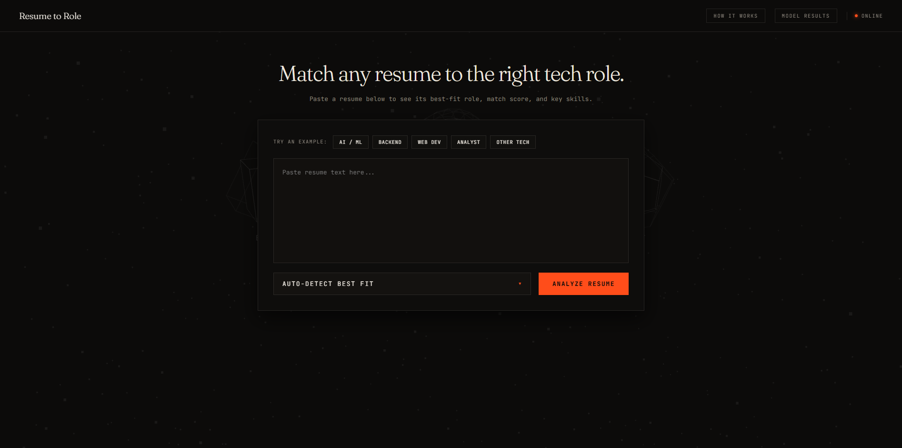
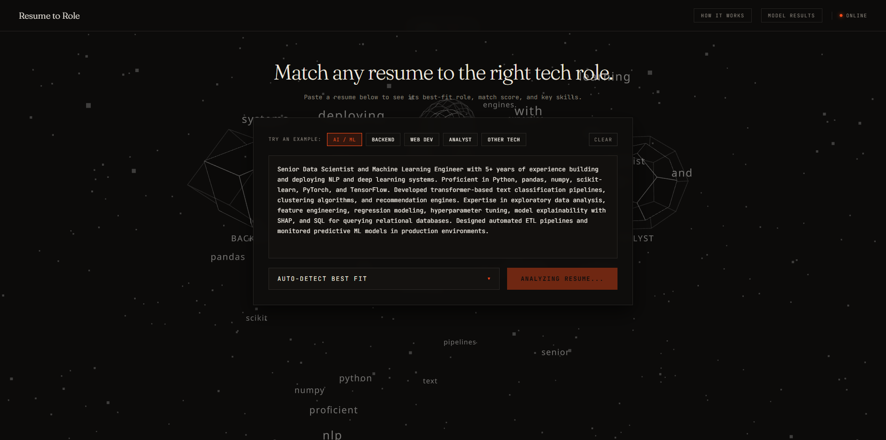
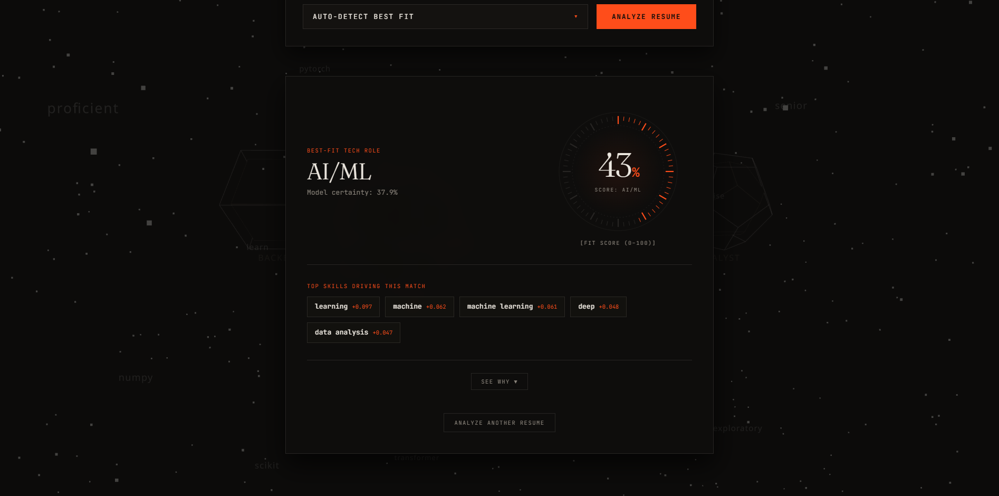
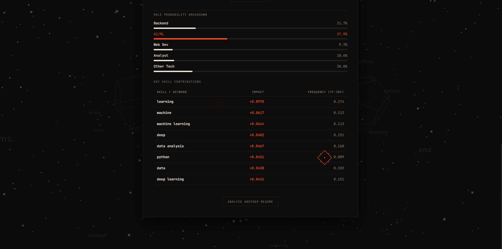
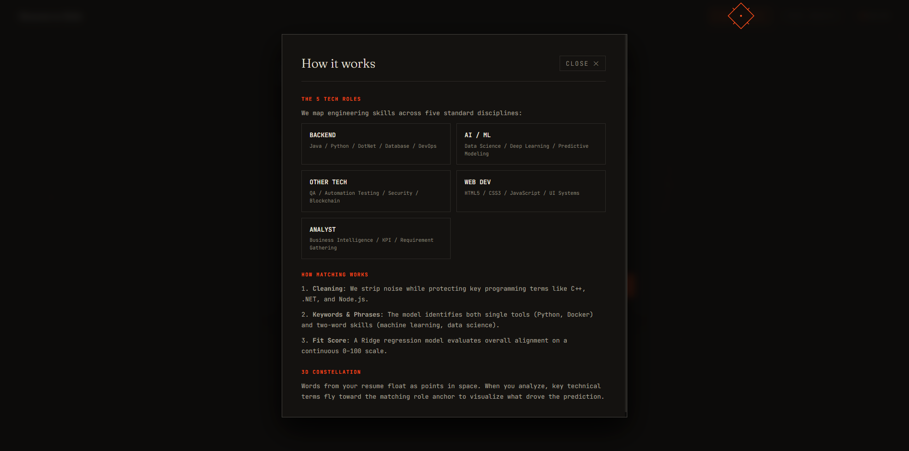
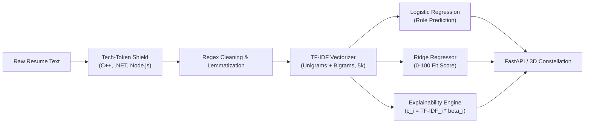

# ⚡ Resume-to-Role Predictor

An end-to-end Natural Language Processing (NLP) system that parses candidate resumes, predicts the best-fit technical role, calculates a continuous **0–100 target role fit score**, and provides mathematical, keyword-level explainability for every recommendation.

Features a modern **dual frontend**:
1. **Interactive 3D Web Experience ("Word Constellation")**: High-performance React 19 + Three.js / React Three Fiber / GSAP frontend communicating with a FastAPI REST backend.
2. **Cinematic Streamlit Dashboard**: A standalone single-process Python dashboard for rapid exploratory analysis.

---

## 📸 Screenshots

| View | Preview | Description |
| :--- | :---: | :--- |
| **01. Landing** |  | Focused editorial landing above the fold: headline, plain English subtext, resume text box, role selector, and Analyze button over a drifting 3D background. |
| **02. Analyzing State** |  | 3D scene illuminates as keywords fly toward the predicted geometric role anchor with velocity and size proportional to their feature weight. |
| **03. Result View** |  | Best-fit role, continuous fit score drawn as a 60-tick precision drafting ring, and top 5 key skills. |
| **04. "See why" Breakdown** |  | Expanded view showing the 5-role probability spectrum and full token impact table. |
| **05. "How it works" Tab** |  | Slide-out overlay explaining the 5 tech disciplines and matching logic in plain English. |

---

## 📌 Project Overview & Taxonomy

The pipeline classifies resumes into **5 standardized tech disciplines**:
- **Backend**: Java, Python, .NET, Databases, Cloud Infrastructure & DevOps
- **AI / ML**: Data Science, Deep Learning, Predictive Modeling
- **Web Dev**: Front-End UI, HTML5, CSS3, JavaScript, Responsive Layouts
- **Analyst**: Business Intelligence, Reporting, Functional Requirements, KPI Tracking
- **Other Tech**: QA Automation Testing, Network Security, SAP, Blockchain

---

## 📊 Dataset & Source

- **Dataset Source**: [Updated Resume Dataset on Kaggle](https://www.kaggle.com/datasets/jillanisofttech/updated-resume-dataset) (`Category` + `Resume` columns, ~962 raw entries across 25 career domains). A pre-bundled copy is already included in this repository at [`data/resume.csv`](data/resume.csv).
- **Domain Pruning**: Non-tech categories (HR, Advocate, Arts, Sales, Health, Chef) were removed, keeping 12 core engineering categories.
- **Deduplication**: The raw Kaggle corpus contains 796 near-identical scraped duplicates. We deduplicate on resume text, leaving **106 unique, high-variance tech resumes** (Train: 84, Test: 22).

---

## 🧠 NLP Pipeline Architecture



1. **Tech-Token Shielding**: Preserves programming languages that contain punctuation (`C++` $\to$ `cplusplus`, `.NET` $\to$ `dotnet`, `Node.js` $\to$ `nodejs`, `scikit-learn` $\to$ `scikitlearn`, `CI/CD` $\to$ `cicd`) before regex punctuation cleaning.
2. **Normalization & Lemmatization**: Strips URLs and emails, removes English stop words, and applies NLTK WordNet lemmatization.
3. **TF-IDF Feature Extraction**: Unigrams and bigrams (`ngram_range=(1, 2)`, `max_features=5000`) with sublinear term-frequency scaling ($1 + \log(\text{tf})$) to prevent keyword stuffing.
4. **Classification**: Multi-class `LogisticRegression` with balanced class weights ($w_j = \frac{N}{K \cdot n_j}$) to protect minority classes (`Web Dev`, `Analyst`) from collapsing into the majority `Backend` class.
5. **Continuous Fit Scoring**: Independent `Ridge` regression models trained per role on $y \in \{0, 100\}$, providing smooth continuous scores that avoid the zero-sum competition of softmax probabilities.
6. **Local Token Explainability**: Computes word-level contribution $c_{k, i} = x^*_i \times \beta_{k, i}$ in real time.

---

## 📈 Experimental Results (Real Test Set Benchmarks)

### 1. Classification Performance (Stratified 80/20 Test Split)

| Model | Accuracy | Macro Precision | Macro Recall | Macro F1 |
| :--- | :---: | :---: | :---: | :---: |
| **Multinomial Naive Bayes** ($\alpha=0.01$) | 81.82% | 0.7238 | 0.6500 | 0.6692 |
| **Logistic Regression** (`class_weight='balanced'`) | **90.91%** | **0.7548** | **0.7833** | **0.7679** |

### 2. Fit Score Regression Benchmark (0–100 Scale on Test Set)

| Target Role | Ridge MAE (0–100) | Ridge $R^2$ | LR Prob MAE (0–100) | LR Prob $R^2$ | Advantage |
| :--- | :---: | :---: | :---: | :---: | :---: |
| **Backend** | **38.23** | **+0.3743** | 48.02 | -0.1086 | **Ridge (-9.79 MAE)** |
| **AI / ML** | **10.57** | **+0.4577** | 19.24 | +0.2478 | **Ridge (-8.67 MAE)** |
| **Web Dev** | **7.87** | **+0.0118** | 15.22 | -0.1114 | **Ridge (-7.35 MAE)** |
| **Analyst** | **11.24** | **+0.2187** | 18.67 | -0.1322 | **Ridge (-7.43 MAE)** |
| **Other Tech** | **32.31** | **+0.3312** | 36.43 | +0.1261 | **Ridge (-4.12 MAE)** |

### 3. Top Driving Keywords by Role (Logistic Regression Coefficients)
- **AI / ML**: `data science` (+0.705), `machine learning` (+0.542), `python` (+0.506), `science` (+0.487)
- **Backend**: `developer` (+0.367), `java developer` (+0.317), `oracle` (+0.208), `sql server` (+0.181)
- **Web Dev**: `bootstrap` (+0.563), `photoshop` (+0.445), `graphic` (+0.440), `css3` (+0.401)
- **Analyst**: `business analyst` (+0.720), `analyst` (+0.629), `business` (+0.466), `functional requirement` (+0.328)
- **Other Tech**: `engineer` (+0.339), `blockchain` (+0.310), `sap` (+0.295), `testing` (+0.264)

---

## 🚀 Setup & Execution Guide

### Prerequisites
- Python 3.10+
- Node.js 18+ and npm

### 1. Environment & Dependencies Setup
```bash
# Clone repository
git clone https://github.com/USERNAME/resume-to-role-predictor.git
cd resume-to-role-predictor

# Create and activate Python virtual environment
python -m venv venv
# Windows:
venv\Scripts\activate
# Linux/macOS:
source venv/bin/activate

# Install Python backend dependencies
pip install -r requirements.txt
```

### 2. Run the 3D Web Application (Recommended)

#### Step 2A: Launch FastAPI Backend
```bash
# Start backend server on port 8000
python -m uvicorn server:app --host 127.0.0.1 --port 8000 --reload
```
*API docs available at: `http://localhost:8000/docs`*

#### Step 2B: Launch React + Three.js Frontend
```bash
cd frontend

# Install frontend dependencies
npm install

# (Optional) Configure environment variable:
# Default is http://localhost:8000
cp .env.example .env

# Start Vite development server on port 3000
npm run dev
```
Open **`http://localhost:3000`** in your browser.

### 3. Alternative: Run Standalone Streamlit Dashboard
```bash
streamlit run app.py
```
Open **`http://localhost:8501`** in your browser.

### 4. Train Models from Scratch (Optional)
```bash
python -m src.train
```

---

## ⚙️ Environment Variables (Frontend)

The frontend automatically detects the API URL via `VITE_API_URL` (defaults to `http://localhost:8000`):

| Variable | Default | Description |
| :--- | :--- | :--- |
| `VITE_API_URL` | `http://localhost:8000` | Base URL pointing to the FastAPI backend |

---

## ⚠️ Limitations & Real-World Caveats

1. **Dataset Scale**: After deduplication and tech-domain filtering, the training set contains 106 unique resumes. While suitable for coursework and academic demonstration, enterprise production models require tens of thousands of samples.
2. **Class Imbalance**: Backend engineers comprise 52.8% of the deduplicated data, while Web Dev and Analyst have fewer than 10 samples each. Balanced loss weighting was required to prevent minority-class collapse.
3. **No Semantic Synonymy**: TF-IDF requires exact n-gram token overlap. It cannot infer that "Kubernetes operator" and "K8s orchestration" represent identical skills unless both appear in the training vocabulary.
4. **Context & Tenure Agnostic**: Bag-of-words representations measure term frequency but cannot differentiate years of experience or recency (e.g., an intern who used Python once vs a 10-year Principal Architect).

---

## 📄 License
This project is released under the [MIT License](LICENSE).
